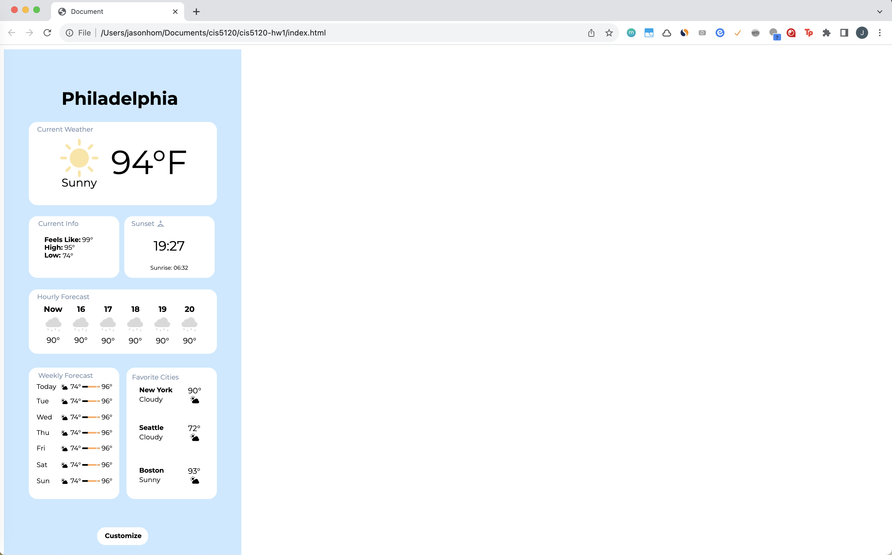

# cis5120-hw1

Project: HTML/CSS prototype for CIS 5120 Assignment 1

Author: Jason Hom

# Attribution

I designed the wireframe in Figma, then used Figma's "Figma to HTML" plug-in to convert the wireframe into base HTML. I then edited the HTML to make some adjustments.

# App Screenshot

